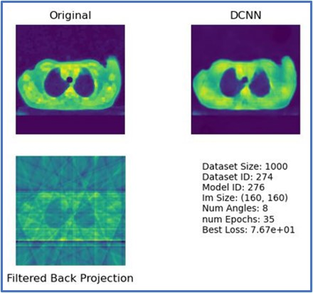
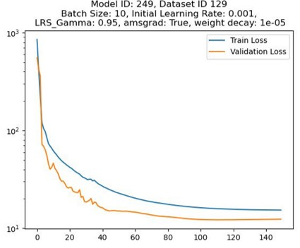

Deep Convolution Neural Network for CT-Image Reconstruction

 
UCSD - ECE 228 - Project Team 22 

Chris Light and Michael Ingerman

## About
Thank you for visiting the project page for Chris Light and Michael Ingerman. 
Here you will find instructions on how to download and run our code.
This project is for ECE 228 at UCSD and our topic is how Deep Learning can drastically improve the medical field
of Computed Tomography. See our project proposal and final report for more info.

## Git Clone and Requirements

> git clone https://github.com/Clight180/ECE-228-Project_Team22

> pip install -r requirements.txt

## Folder Structure

Create a matching folder heirarchy as follows:

* root/
    * processed_images/
    * raw_data/
    * raw_images/
    * saved_figs/
    * savedModels/
    * TensorData/

Upon doing so with matching folder names above, all proceeding code will operate within these folders and create
sub folders as necessary.

## Downloading the Data

> python DataGetter.py

## Create Tensor data for training

> python DatasetGenerator.py args

Where args follows a pattern as described below:
<pre>
numAngles imSize dSize numAngles imSize dSize ...
^______Dataset_______^ ^______Dataset_______^
</pre>

For example:

> python DatasetGenerator.py 64 128 1000 128 128 1000

This creates two separate tensor datasets with random ID allocation. 'dataset_123_size_1000.pt', 
'dataset_934_size_1000.pt' (123 and 934 are random ID assignment)

## Run Experiments

> python main.py args

Where args follows a pattern as described below:
<pre>
numAngles imSize dSize modelNum datasetID numAngles imSize dSize modelNum datasetID ...
^______________Experiment_Specs_________^ ^______________Experiment_Specs_________^
</pre>

For example:

> python main.py 64 128 1000 000 000 128 1000 777 555

This runs two experiments. One being a new dataset and model are created for num angles 64. The other is 
an experiment loading dataset 555 and model 777 with num angles 128. Both are for image sizes 128x128 and dataset
size of 1000.

## Hyperparameter tuning and configs

Adjust any configurations to the experiment by inspecting the config.py file. Command line execution
superceedes the following: numAngles, imDims, trainSize, modelNum, datasetID. 

**There is no support for running on CPU at this time.**

## Voila

Training should proceed and results as similar to below should be observed (for like-experimentation).

